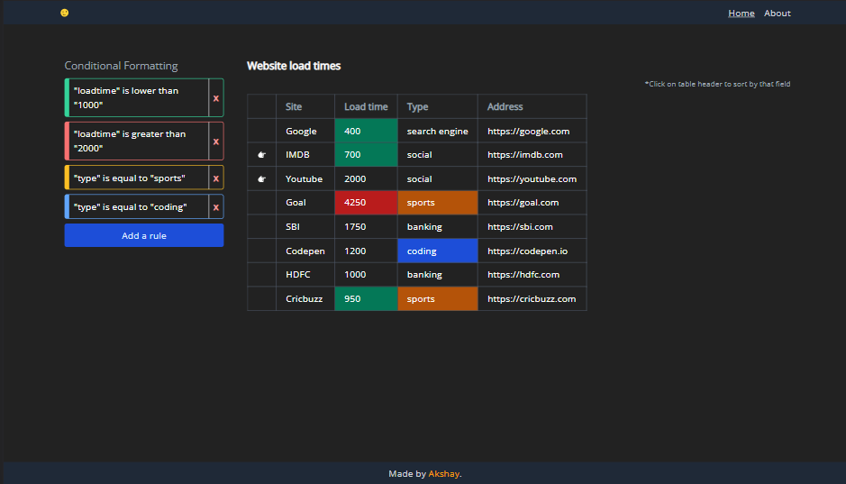

# Sheets-MVP
A react app that takes data and creates a table. You can add rules for conditional formatting of the data.

*Example: users can define a rule saying "where the load time is more than 2 seconds - set background color of the table cell to red"*


This project uses [Vite.js](https://vitejs.dev/) as a build tool.

> **Compatibility Note:**
> Vite requires [Node.js](https://nodejs.org/en/) version >=12.0.0.

### How to use it?
1. Clone the repo
```  ```
2. Install all the packages.
``` npm install ```
3. Run the project
``` npm run dev ``` 



You can check the [demo here](https://sheets-mvp.netlify.app/).
